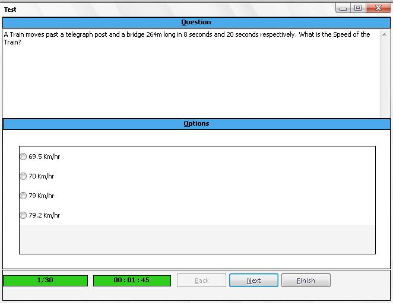



## XML Quiz Prelims

### Description

This application was developed for Quiz Competition. It uses XML for Quiz Question. It contains two parts; Quiz Question Maker - Quiz Prelims Exam.

Quiz Question Maker - To Create the Quiz Question. Questions are stored in .qst file.

Quiz Prelims Exam - To attend the quiz program instead of written.
 
### More Info
 

             |
---                |---
**Submitted On**   |2008-11-27 10:37:18
**By**             |[SelvaGanapathy](https://github.com/Planet-Source-Code/PSCIndex/blob/master/ByAuthor/selvaganapathy.md)
**Level**          |Intermediate
**User Rating**    |5.0 (10 globes from 2 users)
**Compatibility**  |VB 6\.0
**Category**       |[Complete Applications](https://github.com/Planet-Source-Code/PSCIndex/blob/master/ByCategory/complete-applications__1-27.md)
**World**          |[Visual Basic](https://github.com/Planet-Source-Code/PSCIndex/blob/master/ByWorld/visual-basic.md)
**Archive File**   |[XML\_Quiz\_P214617372009\.zip](https://github.com/Planet-Source-Code/selvaganapathy-xml-quiz-prelims__1-71845/archive/master.zip)

